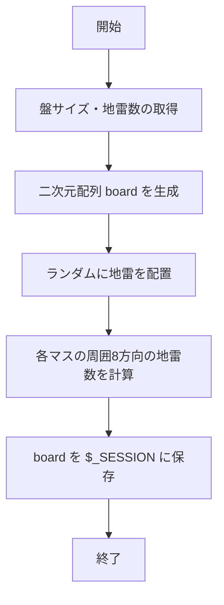
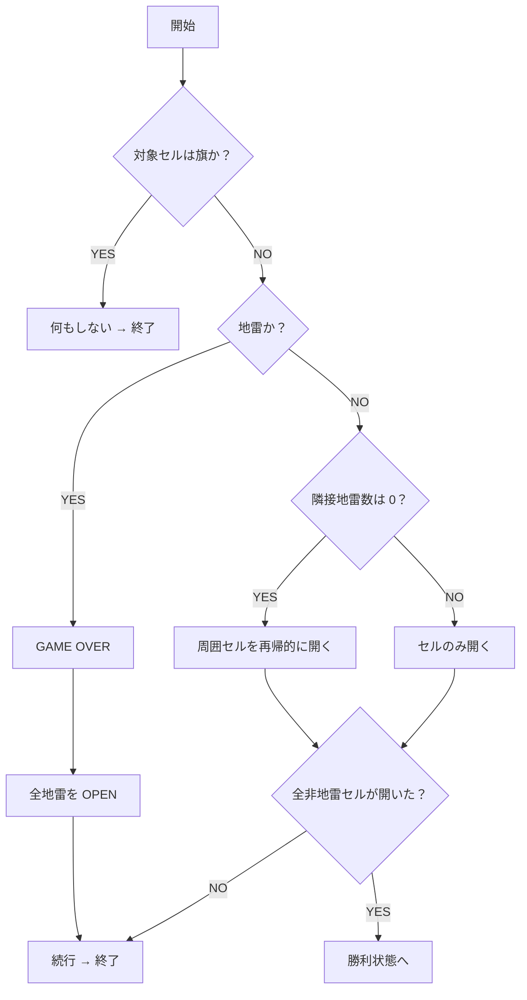
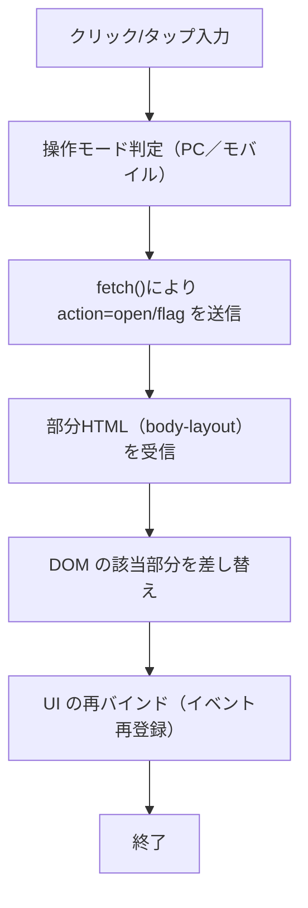
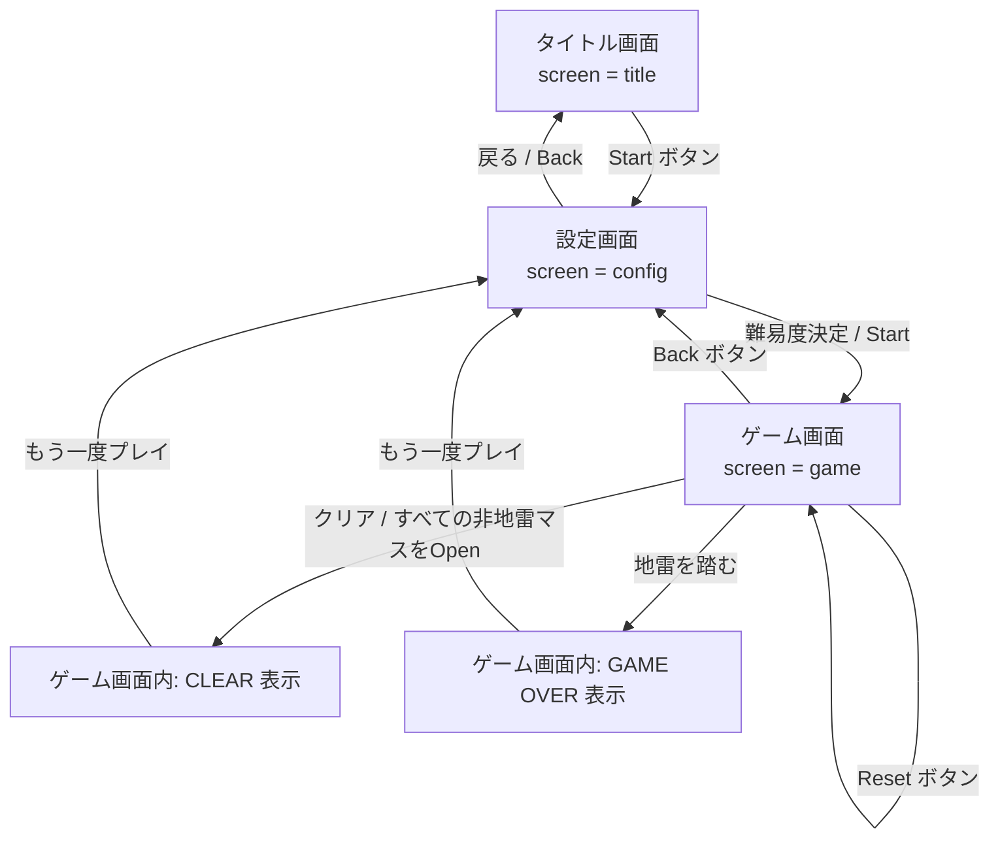
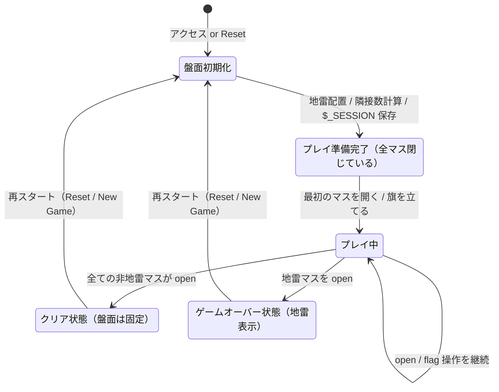
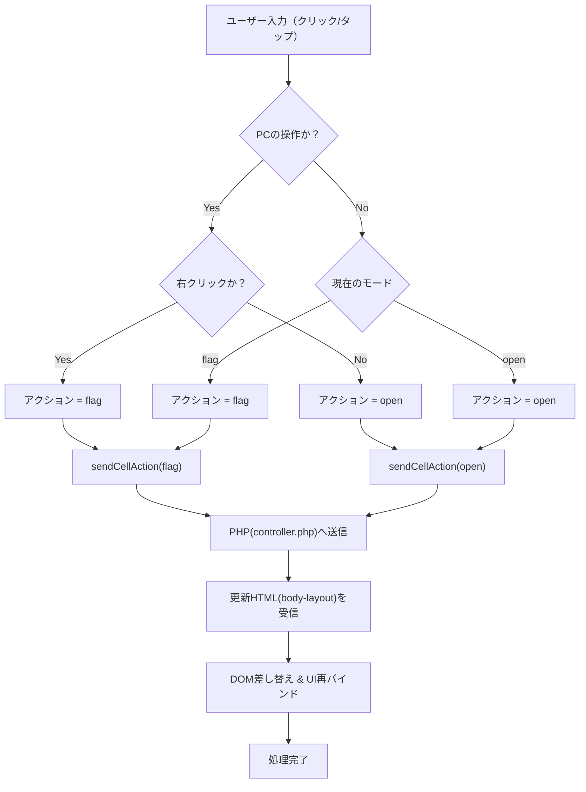
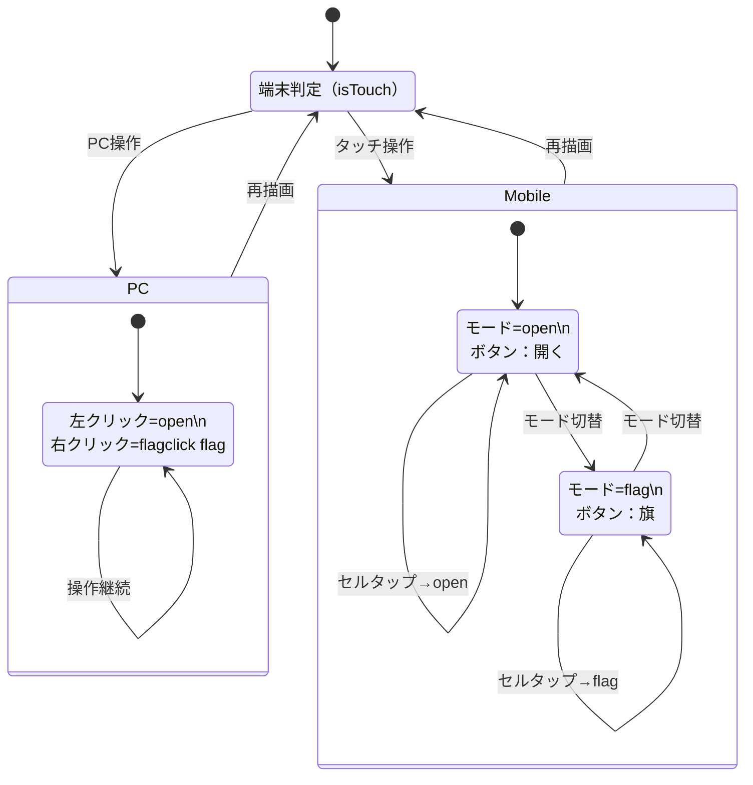

# minesweeper

## 1. 盤面初期化処理（game_logic.php）

## 2. セルを開く処理（openCell）

## 3. フロントエンド操作処理（app.js）

## 4. 画面遷移図（Webページ遷移）

## 5. ゲーム状態遷移図（ロジック側）

## 6.クリック操作の詳細フロー（open / flag 判定）

## 7.PC / Mobile 操作モード切替フロー

